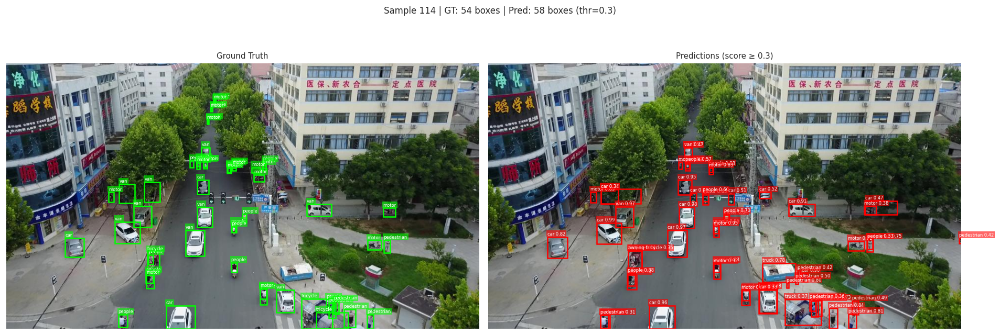
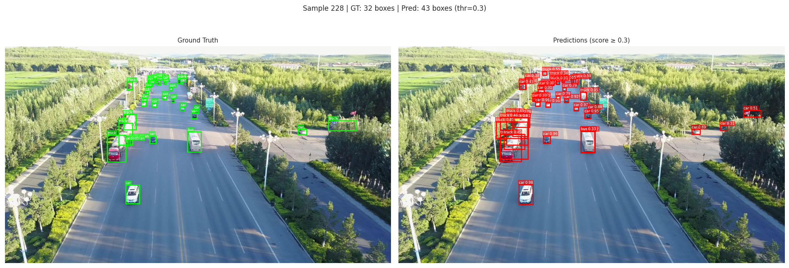

# Tracking-by-Detection on VisDrone using Faster R-CNN and ByteTrack-style Tracking

**Report** | Computer Vision | 

---

## 1. Introduction

Aerial surveillance footage presents some of the most demanding conditions for object detection and tracking: extreme object density, frequent occlusion, and a large fraction of sub-32-pixel objects. The VisDrone2019 benchmark captures these challenges through drone-captured sequences annotated across ten object categories. This report describes a two-stage tracking-by-detection pipeline developed for VisDrone, covering detector training, anchor analysis, and multi-object tracking evaluation.

---

## 2. Objective

The primary goal is to train a detector on VisDrone-DET and evaluate it on DET-val, then apply a tracker on VisDrone-MOT-val and report standard detection and tracking metrics. The pipeline is structured in two parts: **Part A** (detection) and **Part B** (multi-object tracking).

---

## 3. Dataset Overview

Three dataset subsets were used: VisDrone2019-DET-train (6,471 images), DET-val (548 images), and MOT-val (7 sequences). Ignored regions and the ambiguous "others" category were excluded, leaving 10 trainable classes mapped to 11 detector outputs including background.

An exploratory analysis revealed two major characteristics of the dataset. First, it is strongly biased toward small objects — 60.47% of training boxes and 68.56% of validation boxes fall below 32×32 pixels, with average box dimensions of ~38×37 px (train) and ~31×31 px (val). Second, class imbalance is severe: *car* is the most common category and *awning-tricycle* the rarest, producing an imbalance ratio of 44.6×. The MOT-val subset contains 32,404 pedestrian annotations with significant occlusion — 59,822 partially occluded and 7,582 heavily occluded instances.

These findings directly influenced all subsequent design decisions around anchors, augmentation, and tracker configuration.

---

## 4. System Architecture

The overall pipeline follows a standard tracking-by-detection approach:

1. **Detection stage** — A Faster R-CNN detector processes each frame and produces class-labeled bounding boxes with confidence scores.
2. **Filtering stage** — Detections are filtered by target class (pedestrian) and confidence threshold.
3. **Association stage** — A ByteTrack-style tracker associates detections across frames using IoU-based matching.
4. **Track management** — Track states are updated and inactive tracks are removed after a set number of missed frames.
5. **Export** — Results are written in TrackEval-compatible format for metric computation.

---

## 5. Implementation Details

### 5.1 Detection Model

A Torchvision Faster R-CNN with a ResNet-50 FPN backbone was used, initialized from ImageNet pretrained weights. The classification head was replaced to match the 11-class VisDrone setup. This architecture was selected as a well-established two-stage detector with strong feature pyramid support for multi-scale objects.

Preprocessing followed Torchvision defaults: ImageNet normalization, random horizontal flip, and light color jitter. Stronger spatial augmentations such as random cropping were deliberately avoided, as they risk discarding small-object detail that is already marginal in aerial imagery.

Training used: batch size 4, 16 epochs, SGD (lr = 0.005, momentum = 0.9, weight decay = 1e-4), and a StepLR scheduler (step size 5, γ = 0.1).

### 5.2 Anchor Analysis and Refinement

The baseline detector used anchor sizes [32, 64, 128, 256, 512]. An anchor coverage audit showed that this configuration covered only 63.27% of ground-truth boxes, leaving over 126,000 boxes unmatched. Given the EDA finding that the majority of VisDrone objects are sub-32px, this mismatch was expected.

A second experiment was run with smaller anchors [8, 16, 32, 64, 128] to improve coverage for tiny objects. This was a data-driven correction rather than a speculative tuning choice.

### 5.3 Tracking

Two ByteTrack-style association variants were evaluated on top of the same detector checkpoint (`best_model.pth`):

- **Greedy tracker** — associations made by selecting the highest-IoU match iteratively.
- **Hungarian tracker** — globally optimal assignment via the Hungarian algorithm.

Evaluating both variants on the same detections ensures that any metric differences reflect tracker behavior in isolation from detector effects.

---

## 6. Results

### 6.1 Detection

| Metric | Baseline (anchors 32–512) | Small-Anchor (anchors 8–128) |
|---|---|---|
| mAP@0.50:0.95 | 0.1934 | **0.2090** |
| mAP@0.50 | 0.3462 | **0.3743** |
| mAR@0.50:0.95 | 0.2836 | **0.2953** |
| mAR@0.50 | 0.0884 | **0.4846** |
| Precision | 0.1879 | 0.1890 |
| Recall | **0.2667** | 0.2594 |

Smaller anchors improved mAP, mAR, and notably mAR@0.50 by a large margin (+39.6 pp), confirming the anchor coverage hypothesis.

### 6.2 Tracking

| Metric | Greedy Tracker | Hungarian Tracker |
|---|---|---|
| HOTA | 0.3136 | **0.3301** |
| MOTA | -0.2523 | **-0.1255** |
| IDSW | **630** | 993 |
| Precision | 0.4155 | **0.4655** |
| Recall | 0.5730 | **0.6404** |
| IDF1 | 0.3655 | **0.3875** |

The Hungarian variant outperformed greedy across all metrics except identity switches (IDSW), where greedy produced fewer switches (630 vs. 993). In qualitative terms, greedy tracks showed smoother visual continuity in generated preview videos, making both variants informative from different perspectives.

The negative MOTA values arise from a high number of false positives and missed detections on dense aerial frames, which is a known difficulty in VisDrone benchmarks even for well-tuned systems.

---

## 7. Conclusion

This project implemented a complete tracking-by-detection pipeline on VisDrone, grounded in careful data analysis. The EDA-driven anchor redesign produced meaningful detection gains, particularly in recall at IoU 0.50. The comparison between greedy and Hungarian association strategies revealed a clear trade-off: global optimality (Hungarian) improves aggregate metrics, while greedy association reduces identity fragmentation. Future improvements could include stronger small-object detectors (e.g., DINO or YOLOv8-nano), confidence calibration to reduce false positives, and a ReID-based appearance model to stabilize identities under occlusion.

---

## 8. Visual Results

### Detection

### Tracking Videos

- [Tracking video 1](https://drive.google.com/file/d/1JMrIw2ZPGvUHtY7hQNIWZh7XvcJjk5iO/view?usp=sharing)
- [Tracking video 2](https://drive.google.com/file/d/1yL3p88tFvmvh5CaV-7Z3p4E4Iekg7LMd/view?usp=sharing)

---

*All experiments were conducted in a notebook environment under free-GPU constraints. Tracking results correspond to the detector checkpoint used in the original workflow (`best_model.pth`), not the small-anchor retrained model.*
